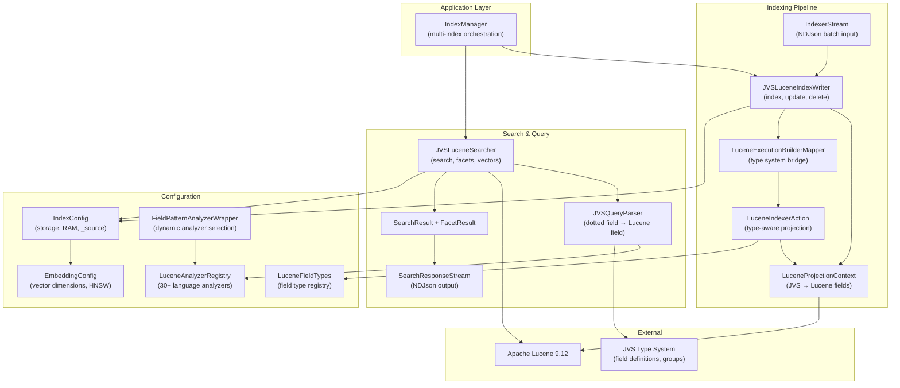
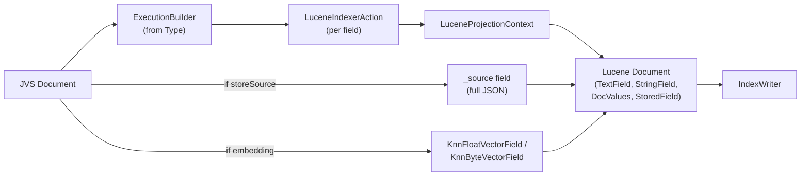
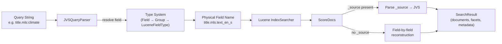
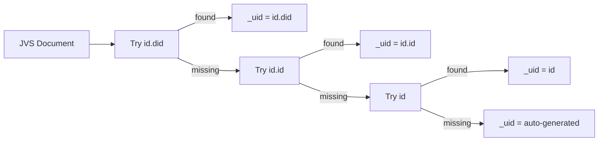
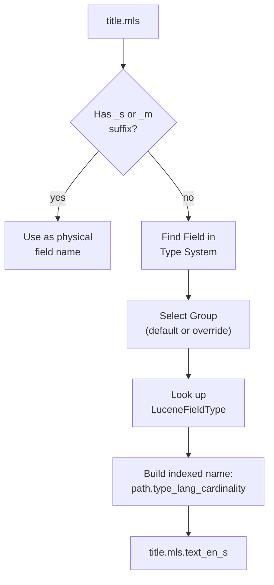
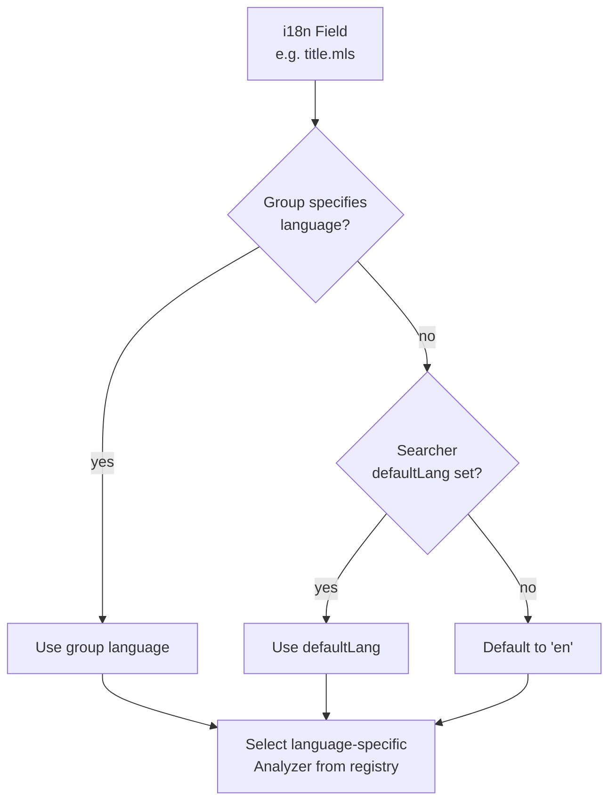
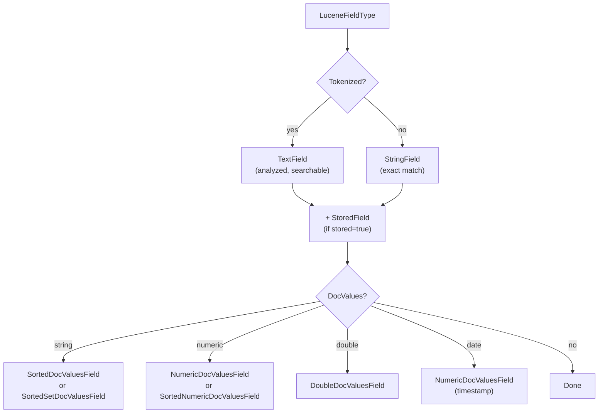
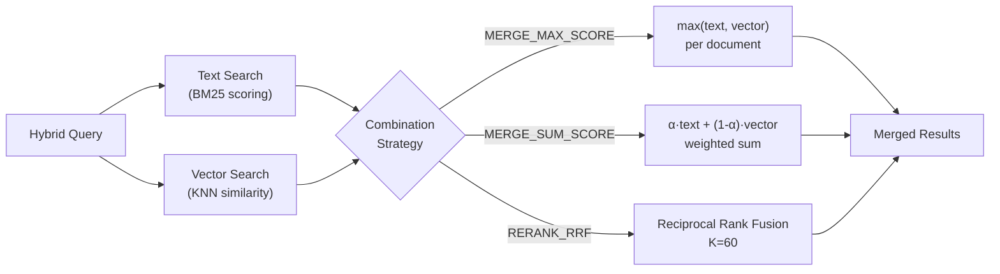
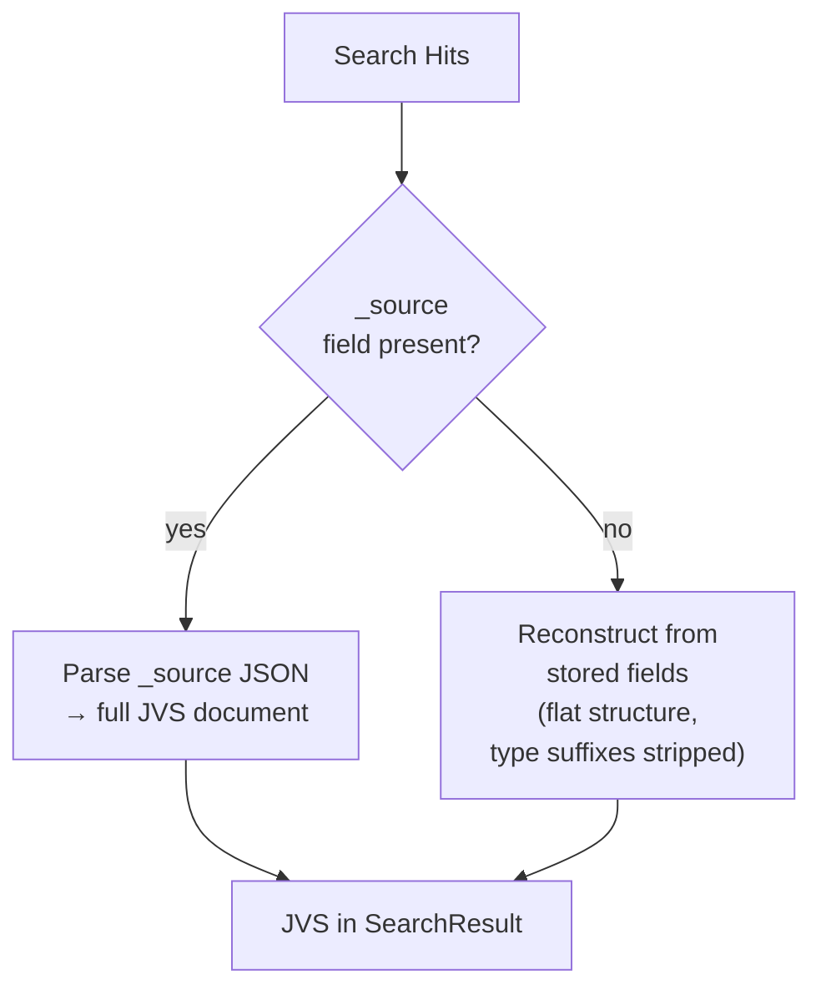
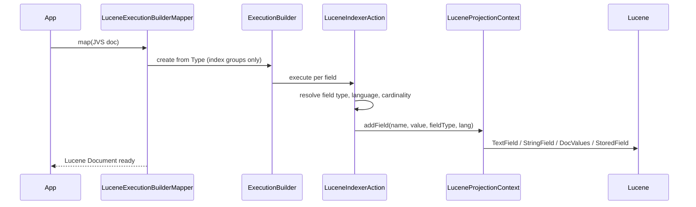

# Hitorro Lucene Index Integration

Apache Lucene integration for the Hitorro JSON Type System (JVS), providing full-text search, fielded search, faceting, vector/hybrid search, and multi-language tokenization with streaming NDJson support.

---

## Table of Contents

- [Features](#features)
- [Prerequisites](#prerequisites)
- [Installation](#installation)
- [Building](#building)
- [Testing](#testing)
- [Architecture](#architecture)
- [Quick Start](#quick-start)
- [IndexConfig](#indexconfig)
- [Indexing Documents](#indexing-documents)
- [Searching](#searching)
- [Query Syntax](#query-syntax)
- [Faceting](#faceting)
- [Multi-Language Support](#multi-language-support)
- [Field Type System](#field-type-system)
- [Streaming NDJson](#streaming-ndjson)
- [Multi-Index Management](#multi-index-management)
- [Vector & Hybrid Search](#vector--hybrid-search)
- [The _source Field](#the-_source-field)
- [Type System Integration](#type-system-integration)
- [Configuration Reference](#configuration-reference)
- [Example Datasets](#example-datasets)
- [Performance Tuning](#performance-tuning)

---

## Features

- **Type-Aware Indexing**: Automatically indexes JVS documents using the Type System's field definitions
- **Multi-Language Support**: Language-specific analyzers for 30+ languages (English, French, German, Chinese, etc.)
- **Fielded Search**: Query specific fields with support for dotted field paths (e.g., `title.mls:search`)
- **Faceting**: String, numeric, and date range facets using Lucene's facet module
- **Streaming API**: NDJson input/output for efficient batch processing
- **Flexible Storage**: In-memory (ByteBuffersDirectory) or filesystem-based indexes
- **Reactive Streams**: Built on Project Reactor for streaming search results
- **Vector Search**: KNN/ANN embedding search with HNSW indexing (float and byte vectors)
- **Hybrid Search**: Combined text + vector search with multiple fusion strategies
- **Multi-Index Management**: IndexManager for creating, searching, and managing multiple named indexes
- **`_source` Field**: Optional full-document JSON storage for faithful reconstruction

---

## Prerequisites

| Requirement | Version | Notes |
|-------------|---------|-------|
| **Java** | 21+ | Required |
| **Maven** | 3.8+ | Required for building |
| **hitorro-util** | 3.0.0+ | JVS core, type system, NLP |

---

## Installation

Add the dependency to your `pom.xml`:

```xml
<dependency>
    <groupId>com.hitorro</groupId>
    <artifactId>hitorro-index</artifactId>
    <version>3.0.0</version>
</dependency>
```

Artifacts are resolved from Maven Central and the hitorro-maven GitHub repository.

---

## Building

```bash
cd hitorro-index

# Full build with tests
mvn clean install

# Build without tests
mvn clean install -DskipTests

# Or use the build script
./build.sh
```

### Build Dependencies

| Library | Version | Purpose |
|---------|---------|---------|
| Apache Lucene | 9.12.0 | Core, queryparser, analysis-common, facet, backward-codecs |
| hitorro-util | 3.0.0 | JVS core, type system, JSON utilities |
| Project Reactor | 3.6.11 | Reactive streaming for NDJson and search results |
| Jackson | 2.18.2 | JSON processing |
| JUnit 5 | 5.11.4 | Testing framework |
| Mockito | 5.14.2 | Mocking framework |
| AssertJ | 3.27.3 | Fluent test assertions |

---

## Testing

```bash
# Run all tests
mvn test

# Run a single test class
mvn test -Dtest=IndexManagerTest

# Run a single test method
mvn test -Dtest=LuceneIndexIntegrationTest#testBasicIndexAndSearch
```

Tests use in-memory indexes (ByteBuffersDirectory) for fast execution -- no filesystem setup required.

### Test Coverage

| Test Class | What It Tests |
|------------|--------------|
| `IndexManagerTest` | Multi-index creation, named index operations, cross-index search |
| `LuceneIndexIntegrationTest` | Basic indexing, batch indexing, search, document reconstruction |
| `StreamingTest` | NDJson streaming input and output |
| `FieldPatternAnalyzerWrapperTest` | Field name pattern matching and language-specific analyzer selection |
| `EmbeddingConfigTest` | Vector configuration validation and builder |
| `VectorSimilarityTest` | Similarity metric mappings to Lucene functions |
| `EmbeddingSearchTest` | KNN vector search integration |
| `ByteVectorTest` | Quantized byte vector indexing and search |
| `EmbeddingDebugTest` | Vector search debugging utilities |
| `ExampleDatasetsTest` | Dataset loading, field validation, multi-index search, pagination |

---

## Architecture



### Key Design Patterns

- **Builder Pattern**: `IndexConfig.builder()`, `JVSLuceneSearcher.builder()`, `EmbeddingConfig.builder()`, `EmbeddingSearchRequest.builder()`, `HybridSearchRequest.builder()`
- **ExecutionBuilder (Type System)**: Type definitions drive field projection -- the type declares what fields to index, under what method, and the indexer maps to Lucene field types automatically
- **Thread Safety**: `ReentrantReadWriteLock` in the index writer for concurrent access
- **Graceful Reconstruction**: Search results prefer `_source` (full JSON), falling back to field-by-field reconstruction

### Indexing Data Flow



### Search Data Flow



---

## Quick Start

### 1. Create an Index

```java
// In-memory index (testing)
IndexConfig config = IndexConfig.inMemory().build();

// Filesystem-based index (production)
IndexConfig config = IndexConfig.filesystem("/path/to/index").build();
```

### 2. Index Documents

```java
try (JVSLuceneIndexWriter indexWriter = new JVSLuceneIndexWriter(config)) {
    // Index single document
    JVS doc = new JVS();
    doc.set("title", "My Document");
    doc.set("content", "This is the document content");
    indexWriter.indexDocument(doc);

    // Or batch index
    List<JVS> documents = Arrays.asList(doc1, doc2, doc3);
    indexWriter.indexDocuments(documents);

    indexWriter.commit();
}
```

### 3. Search Documents

```java
try (JVSLuceneSearcher searcher = JVSLuceneSearcher.builder()
        .config(config)
        .build()) {

    SearchResult result = searcher.search("content:document", 0, 10);

    System.out.println("Found " + result.getTotalHits() + " documents");
    for (JVS doc : result.getDocuments()) {
        System.out.println(doc);
    }
}
```

### 4. Search with Facets

```java
SearchResult result = searcher.search("content:news", 0, 10,
    Arrays.asList("category", "author"));

Map<String, FacetResult> facets = result.getFacets();
for (Map.Entry<String, FacetResult> entry : facets.entrySet()) {
    System.out.println("Facet: " + entry.getKey());
    for (FacetResult.FacetValue value : entry.getValue().getValues()) {
        System.out.println("  " + value.getValue() + ": " + value.getCount());
    }
}
```

---

## IndexConfig

Configure index storage and behavior with the builder pattern:

```java
IndexConfig config = IndexConfig.builder()
    .filesystem("/path/to/index")       // or .inMemory()
    .ramBufferSize(32.0)                // MB, default 16.0
    .maxBufferedDocs(1000)              // default -1 (unlimited)
    .autoCommit(true)                   // default true
    .commitInterval(60)                 // seconds, default 60
    .storeSource(false)                 // default true
    .embeddings(embeddingConfig)        // optional vector config
    .build();
```

| Parameter | Default | Description |
|-----------|---------|-------------|
| `inMemory()` | -- | ByteBuffersDirectory (testing) |
| `filesystem(path)` | -- | FSDirectory (production) |
| `directory(Directory)` | -- | Custom Lucene Directory |
| `ramBufferSize` | 16.0 MB | RAM buffer before flush |
| `maxBufferedDocs` | -1 | Max docs before flush (-1 = unlimited) |
| `autoCommit` | true | Auto-commit on index operations |
| `commitInterval` | 60 sec | Commit frequency |
| `storeSource` | true | Store full JSON as `_source` field |
| `embeddings` | null | Vector search configuration |

---

## Indexing Documents

### JVSLuceneIndexWriter

```java
try (JVSLuceneIndexWriter writer = new JVSLuceneIndexWriter(config)) {
    // Single document
    writer.indexDocument(jvs);

    // Single document with out-of-band embedding
    writer.indexDocument(jvs, new float[]{0.1f, 0.2f, 0.3f});

    // Batch index
    writer.indexDocuments(List.of(doc1, doc2, doc3));

    // Batch with separate _source documents
    writer.indexDocuments(jvsDocs, sourceJsonNodes);

    // Update by ID
    writer.updateDocument("id.did", "doc-001", updatedJvs);

    // Delete by ID
    writer.deleteDocument("id.did", "doc-001");

    // Delete all
    writer.deleteAll();

    // Commit and flush
    writer.commit();
    writer.flush();
}
```

### ID Management

The writer automatically extracts document IDs for deduplication and update-by-ID:



The `_uid` field enables replace-on-update semantics -- `updateDocument` deletes the old version and indexes the new one.

---

## Searching

### JVSLuceneSearcher

```java
try (JVSLuceneSearcher searcher = JVSLuceneSearcher.builder()
        .config(config)
        .type(myType)              // optional: Type for field resolution
        .defaultLang("en")         // optional: default language for i18n fields
        .build()) {

    // Basic search
    SearchResult result = searcher.search("content:document", 0, 10);

    // Search with facets
    SearchResult result = searcher.search("content:news", 0, 10,
        List.of("category", "department"));

    // Search with facets and language override
    SearchResult result = searcher.search("title.mls:klima", 0, 10,
        List.of("department"), "de");

    // Fielded search (multiple fields combined with AND)
    SearchResult result = searcher.fieldedSearch(
        Map.of("title.mls", "climate", "department", "Research"),
        0, 10);

    // Streaming search (reactive)
    Flux<JVS> stream = searcher.searchStream("query", 0, 100);
    stream.subscribe(doc -> process(doc));

    // Refresh searcher to see latest changes
    searcher.refresh();
}
```

### SearchResult

```java
SearchResult result = searcher.search(query, 0, 10, facetDims);

result.getTotalHits();          // Total matching documents
result.getDocuments();          // List<JVS> results
result.getFacets();             // Map<String, FacetResult>
result.getQuery();              // Original query string
result.getOffset();             // Pagination offset
result.getLimit();              // Page size
result.getSearchTimeMs();       // Execution time in ms
result.hasFacets();             // Boolean
result.toMetadataJVS();         // Metadata as JVS
result.toFacetsJVS();           // Facets as JVS
```

---

## Query Syntax

Supports standard Lucene query syntax with JVS dotted field paths:

```
title:search                         -- Search in title field
title.mls:hello                      -- Dotted field path (resolved via type system)
title.mls.text_en_s:hello            -- Direct physical field name
content:("hello world")              -- Phrase search
title:test AND content:data          -- Boolean query
field:[10 TO 20]                     -- Range query
content:test*                        -- Wildcard (leading wildcards allowed)
```

### Field Resolution

The `JVSQueryParser` resolves JVS field paths to physical Lucene field names:



Examples of resolution:

| Input Query Field | Resolved Physical Field |
|-------------------|------------------------|
| `title.mls` | `title.mls.text_en_s` |
| `title.mls.text` | `title.mls.text_en_s` (method override) |
| `title.mls.text_de_s` | `title.mls.text_de_s` (already physical) |
| `department` | `department.identifier_s` |

---

## Faceting

Faceting aggregates field values across matching documents. Requires fields with `docValues=true`.

```java
// Request facets during search
SearchResult result = searcher.search("*:*", 0, 10,
    List.of("department", "classification", "author"));

// Process facet results
for (Map.Entry<String, FacetResult> entry : result.getFacets().entrySet()) {
    System.out.println("Dimension: " + entry.getKey());
    FacetResult facet = entry.getValue();
    System.out.println("  Total count: " + facet.getTotalCount());
    for (FacetResult.FacetValue fv : facet.getValues()) {
        System.out.println("  " + fv.getValue() + ": " + fv.getCount());
    }
}
```

Uses `SortedSetDocValuesFacetCounts` internally. Returns top 100 values per dimension. Supports multi-valued fields.

---

## Multi-Language Support

### Supported Languages (30+)

Language-specific analyzers are automatically selected for fields marked `i18n: true`:

| Language | Code | Analyzer |
|----------|------|----------|
| English | en | EnglishAnalyzer |
| German | de | GermanAnalyzer |
| French | fr | FrenchAnalyzer |
| Spanish | es | SpanishAnalyzer |
| Italian | it | ItalianAnalyzer |
| Portuguese | pt | PortugueseAnalyzer |
| Dutch | nl | DutchAnalyzer |
| Swedish | sv | SwedishAnalyzer |
| Danish | da | DanishAnalyzer |
| Norwegian | no | NorwegianAnalyzer |
| Finnish | fi | FinnishAnalyzer |
| Russian | ru | RussianAnalyzer |
| Arabic | ar | ArabicAnalyzer |
| Chinese/Japanese/Korean | zh, ja, ko | CJKAnalyzer |
| ... and more | bg, ca, cs, el, fa, hi, hu, id, ro, th, tr, etc. | Language-specific |

### How Language Selection Works



### Custom Analyzers

```java
// Register a custom language analyzer
LuceneAnalyzerRegistry.registerLanguageAnalyzer("custom", new MyAnalyzer());

// Register a custom type analyzer
LuceneAnalyzerRegistry.registerTypeAnalyzer("specialfield", new MyAnalyzer());
```

---

## Field Type System

### Field Naming Convention

Fields are named following a SOLR-style convention: `path.type[_lang]_cardinality`

| Example | Path | Type | Language | Cardinality |
|---------|------|------|----------|-------------|
| `title.mls.text_en_s` | title.mls | text | en | single |
| `tags.text_de_m` | tags | text | de | multi |
| `brand.identifier_s` | brand | identifier | -- | single |
| `price.double_s` | price | double | -- | single |
| `published.date_m` | published | date | -- | multi |

Cardinality: `s` = single-valued, `m` = multi-valued.

### Lucene Field Types

Configured in `config/jsonconfigs/lucene_fields.json`:

| Type | Tokenized | i18n | DocValues | Use Case |
|------|-----------|------|-----------|----------|
| `text` | yes | yes | no | Full-text search (language-analyzed) |
| `textmarkup` | yes | yes | no | HTML/XML text (language-analyzed) |
| `identifier` | no | no | yes | Exact match, faceting |
| `long` | no | no | yes | Numeric integer values |
| `int` | no | no | yes | Numeric integer values |
| `double` | no | no | yes | Numeric decimal values |
| `date` | no | no | yes | Date values (stored as timestamps) |

### Field Projection to Lucene



---

## Streaming NDJson

### Input: Indexing from NDJson

```java
IndexerStream indexerStream = IndexerStream.builder()
    .indexWriter(indexWriter)
    .batchSize(100)              // documents per batch
    .commitAfterBatch(true)      // commit after each batch
    .build();

// From InputStream
Flux<IndexingResult> results = indexerStream.indexFromStream(inputStream);
results.subscribe(batch -> {
    System.out.println("Indexed: " + batch.getSuccessCount());
    System.out.println("Errors: " + batch.getErrorCount());
    System.out.println("Duration: " + batch.getDurationMs() + "ms");
});

// From reactive JSON strings
Flux<IndexingResult> results = indexerStream.indexFromJsonFlux(jsonFlux);

// From reactive JVS objects
Flux<IndexingResult> results = indexerStream.indexFromJVSFlux(jvsFlux);
```

### Output: Search Results as NDJson

```java
SearchResult result = searcher.search("query", 0, 100);

// Reactive NDJson stream
Flux<String> ndjson = SearchResponseStream.toNDJson(result);
ndjson.subscribe(System.out::println);

// Single string with newlines
String ndjsonString = SearchResponseStream.toNDJsonString(result);

// Reactive JVS stream
Flux<JVS> jvsStream = SearchResponseStream.toJVSStream(result);
```

### NDJson Output Format

```
{"totalHits": 42, "query": "climate", "offset": 0, "limit": 10, "searchTimeMs": 12, "returned": 10}
{"department": {"values": [{"value": "Research", "count": 15}], "totalCount": 42}}
{"_score": 0.95, "title": "Climate Report", "department": "Research", ...}
{"_score": 0.87, "title": "Environmental Policy", "department": "Legal", ...}
...
```

Line 1: metadata, Line 2: facets (if any), Lines 3+: one document per line.

---

## Multi-Index Management

`IndexManager` orchestrates multiple named indexes:

```java
IndexManager manager = new IndexManager();

// Create named indexes
manager.createIndex("articles", articleConfig, articleType);
manager.createIndex("products", productConfig, productType);

// Index into specific indexes
manager.indexDocument("articles", articleDoc);
manager.indexDocuments("products", productDocs);
manager.commit("articles");

// Search a single index
SearchResult result = manager.search("articles", "title:climate", 0, 10,
    List.of("category"));

// Search across multiple indexes
SearchResult result = manager.searchMultiple(
    List.of("articles", "products"),
    "search query", 0, 10);
// Each result document has an _index field identifying its source

// Vector search
SearchResult result = manager.searchByEmbedding("articles", embeddingRequest);

// Hybrid search
SearchResult result = manager.searchHybrid("articles", hybridRequest);

// Manage indexes
manager.hasIndex("articles");           // true
manager.getIndexNames();                // ["articles", "products"]
manager.clearIndex("articles");         // delete all docs
manager.closeIndex("products");         // close and remove
```

---

## Vector & Hybrid Search

### Embedding Configuration

```java
EmbeddingConfig embeddingConfig = EmbeddingConfig.builder()
    .fieldName("_embedding")                    // default
    .dimension(384)                             // vector size (max 4096)
    .similarity(VectorSimilarity.COSINE)        // COSINE, DOT_PRODUCT, EUCLIDEAN, MAXIMUM_INNER_PRODUCT
    .fieldType(EmbeddingFieldType.FLOAT_VECTOR) // or BYTE_VECTOR (4x memory savings)
    .hnswM(16)                                  // HNSW max connections (range 2-96)
    .hnswEfConstruction(100)                    // HNSW build-time depth (range 1-3200)
    .enabled(true)
    .build();

IndexConfig config = IndexConfig.inMemory()
    .embeddings(embeddingConfig)
    .build();
```

### Common Embedding Dimensions

| Model | Dimensions |
|-------|-----------|
| all-MiniLM-L6-v2 | 384 |
| all-mpnet-base-v2 | 384 |
| BERT-base | 768 |
| OpenAI text-embedding-ada-002 | 1536 |
| OpenAI text-embedding-3-large | 3072 |

### Vector Search (KNN)

```java
EmbeddingSearchRequest request = EmbeddingSearchRequest.builder()
    .queryVector(new float[]{0.1f, 0.2f, ...})  // or .queryByteVector(bytes)
    .k(10)                                        // number of results
    .includeScores(true)
    .build();

SearchResult result = searcher.searchByEmbedding(request);
```

### Hybrid Search (Text + Vector)



```java
HybridSearchRequest request = HybridSearchRequest.builder()
    .textQuery("climate change research")
    .queryVector(new float[]{0.1f, 0.2f, ...})
    .k(10)
    .strategy(HybridSearchRequest.CombinationStrategy.RERANK_RRF)
    .alpha(0.5)                    // for MERGE_SUM_SCORE: 0=pure vector, 1=pure text
    .build();

SearchResult result = searcher.searchHybrid(request);
```

### Byte Vector Quantization

For memory-efficient embeddings, use byte vectors. Float values in `[-1, 1]` are quantized to bytes in `[-128, 127]`:

```java
EmbeddingConfig config = EmbeddingConfig.builder()
    .dimension(384)
    .fieldType(EmbeddingFieldType.BYTE_VECTOR)  // 4x memory savings
    .build();
```

---

## The _source Field

When `storeSource(true)` (the default), the full original document JSON is stored in a `_source` field in the Lucene index:



- **Enabled** (default): Faithful document reconstruction. Larger index size.
- **Disabled** (`storeSource(false)`): Smaller index. Results contain only projected stored fields (flat). Use with an external store (e.g., RocksDB KVStore) for full document retrieval.

---

## Type System Integration

The indexer uses the JVS Type System's ExecutionBuilder pattern to automatically project documents:



1. The Type definition declares which fields to index (fields in "index" groups)
2. `LuceneExecutionBuilderMapper` creates an ExecutionBuilder filtered to index groups
3. `LuceneIndexerFactory` creates a `LuceneIndexerAction` per field
4. Each action resolves the `LuceneFieldType` and projects the value to the appropriate Lucene field(s)
5. `LuceneProjectionContext` assembles the final Lucene Document

---

## Configuration Reference

### Lucene Field Types

Edit `config/jsonconfigs/lucene_fields.json`:

```json
{
  "fields": [
    {
      "name": "text",
      "i18n": true,
      "isid": true,
      "stored": true,
      "indexed": true,
      "tokenized": true,
      "docValues": false
    }
  ]
}
```

| Property | Type | Description |
|----------|------|-------------|
| `name` | string | Field type name (text, identifier, long, etc.) |
| `i18n` | boolean | Supports language-specific analysis |
| `isid` | boolean | Can be used as document ID |
| `stored` | boolean | Value retrievable in search results |
| `indexed` | boolean | Field is searchable |
| `tokenized` | boolean | Field is analyzed (tokenized) |
| `docValues` | boolean | Supports faceting and sorting |

---

## Example Datasets

The `ExampleDatasets` utility class provides three pre-built datasets for testing, demos, and quick-start scenarios. Each dataset has 15 documents with distinct field structures.

### Available Datasets

| Dataset | Index Name | Fields | Content |
|---------|-----------|--------|---------|
| `ARTICLES` | `articles` | id, title, content, author, department, tags, doctype | News and research articles (climate, quantum, AI, gene therapy, etc.) |
| `PRODUCTS` | `products` | id, name, description, brand, price, category, inStock, doctype | E-commerce products (laptop, headphones, desk, shoes, etc.) |
| `MOVIES` | `movies` | id, title, plot, director, genre, year, rating, doctype | Film catalog (thriller, sci-fi, drama, animation, etc.) |

### Loading Datasets

```java
IndexManager manager = new IndexManager("en");

// Load a single dataset
ExampleDatasets.loadArticles(manager);

// Load selected datasets
ExampleDatasets.load(manager, Dataset.ARTICLES, Dataset.MOVIES);

// Load all three datasets
ExampleDatasets.LoadResult result = ExampleDatasets.loadAll(manager);
System.out.println("Loaded " + result.getTotalLoaded() + " documents"); // 45
System.out.println("Datasets: " + result.getLoadedDatasets());         // [ARTICLES, PRODUCTS, MOVIES]
```

### Searching Loaded Indices

```java
IndexManager manager = new IndexManager("en");
ExampleDatasets.loadAll(manager);

// Search a single index
SearchResult articles = manager.search("articles", "*:*", 0, 10, null);

// Search across selected indices
SearchResult result = manager.searchMultiple(
    List.of("articles", "movies"), "*:*", 0, 20);

// Search all three indices
SearchResult all = manager.searchMultiple(
    List.of("articles", "products", "movies"), "*:*", 0, 50);
// 45 total hits
```

### Accessing Raw Documents

```java
// Get documents without indexing
List<JVS> articles = ExampleDatasets.getArticles();
List<JVS> products = ExampleDatasets.getProducts();
List<JVS> movies   = ExampleDatasets.getMovies();

// Or by enum
List<JVS> docs = ExampleDatasets.getDocuments(Dataset.PRODUCTS);

// List available datasets
List<Dataset> available = ExampleDatasets.getAvailableDatasets();
```

### LoadResult Metadata

```java
ExampleDatasets.LoadResult result = ExampleDatasets.loadAll(manager);

result.getManager();                           // the IndexManager
result.getTotalLoaded();                       // 45
result.getLoadedDatasets();                    // Set<Dataset>
result.getLoadedCounts();                      // {ARTICLES=15, PRODUCTS=15, MOVIES=15}
result.getLoadedCounts().get(Dataset.MOVIES);  // 15
```

---

## Performance Tuning

| Parameter | Default | Guidance |
|-----------|---------|----------|
| `ramBufferSize` | 16 MB | Increase for high-throughput indexing (32-256 MB) |
| `maxBufferedDocs` | -1 | Set to limit memory usage per flush |
| `commitInterval` | 60 sec | Lower for near-real-time search visibility |
| `storeSource` | true | Disable to reduce index size when using external store |
| `batchSize` (streaming) | 100 | Increase for faster bulk indexing |
| `hnswM` | 16 | Higher = better recall, more memory (range 2-96) |
| `hnswEfConstruction` | 100 | Higher = better graph quality, slower indexing (range 1-3200) |

---

## License

MIT License -- Copyright (c) 2006-2025 Chris Collins
